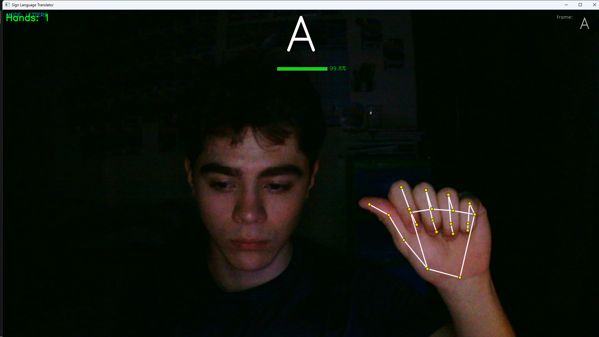

# Sign Language Translator

Real-time American Sign Language (ASL) recognition from your webcam. The app
detects hand signs, turns them into on-screen text, and is built to grow into
a full sign-to-text-and-voice translator. The goal is to remove communication
barriers between deaf and hearing people without either side needing to know
sign language beforehand.

It works out of the box: clone, install, run. Pre-trained models are included,
so you can try it immediately — and you can also capture your own signs and
retrain it to make it yours.

> **Tech:** Python · MediaPipe · TensorFlow/Keras · OpenCV · scikit-learn



*Live detection: MediaPipe draws the 21 hand landmarks, the model predicts the
letter, and a confidence bar confirms it.*

---

## How it works

The pipeline runs per camera frame:

```
Camera frame
  → MediaPipe detects the hand and extracts 21 landmarks (x, y, z) = 63 numbers
  → normalize_landmarks (wrist-centered + scale-invariant)
  → a small dense neural network classifies the sign
  → temporal smoothing removes single-frame flicker
  → the stable prediction is drawn on screen
```

The model learns the **geometry** of the hand (joint coordinates), not its
appearance. That makes it robust to lighting, skin tone, background, and
distance to the camera.

There are two models:

| Model | Input | Detects |
|---|---|---|
| **Letters** (`model_one_hand.h5`) | 63 landmark values (one frame) | Static ASL letters |
| **Words** (`model_words.h5`) | a sequence of 32 frames × 130 body-anchored values | Dynamic signs / whole words |

The words model is a **temporal sequence model** (a TCN — stacked 1-D
convolutions over time). It reads the *ordered* movement of the hands, so it can
tell signs apart by *how* the hands move, not just the average pose. This is the
key to scaling the vocabulary: a movement summary that ignores order collapses
once two signs share a similar average shape.

Each frame holds **both hands** (handshape) plus **where each hand is relative
to the shoulders** (a body anchor, via MediaPipe pose). That lets the model
separate signs with the same handshape at different body locations (hand at the
chest vs. the forehead) and signs that genuinely use two hands. Letters stay
one-hand and are unaffected.

### Two-stage design: recognize, then translate

Recognition outputs **glosses** — English keywords in citation form
(`WANT DRINK NOW`). A second stage sends those to an LLM (Claude) which produces
a fluent sentence with correct grammar and tense (*"Quiero tomar algo ahora."*).
Conjugation and tense live in the translation layer, not the recognizer: ASL
doesn't conjugate verbs, so teaching the recognizer conjugated forms would be
both wrong and explosive. Press **T** in words mode to translate the signed
sentence. Works offline too (falls back to the raw glosses).

---

## Quick start

You need **Python 3.10+** and a webcam.

```bash
# 1. Clone
git clone <your-repo-url>
cd Sign_Language_Translator

# 2. Create and activate a virtual environment
python -m venv venv
venv\Scripts\activate          # Windows
# source venv/bin/activate     # Linux / macOS

# 3. Install dependencies
pip install -r requirements.txt

# 4. Run
python main.py
```

### Keyboard shortcuts

| Key | Action |
|---|---|
| **Q** | Quit the application |
| **L** | Switch to letters mode |
| **W** | Switch to words mode |
| **N** | Switch to numbers mode |
| **E** | Export the conversation log (TXT + CSV to `logs/`) |
| **T** | Translate the signed sentence to fluent text (words mode) |
| **P** | Toggle speech-to-text microphone (if enabled) |

The translation layer uses the Claude API. Set `ANTHROPIC_API_KEY` in your
environment to enable it; without a key the app still runs and **T** just joins
the recognized glosses. Tune it in [config.py](config.py) section 10.

The pre-trained models are already in the repo, so the app runs right after
installing — no dataset download or training required.

---

## Using the app

The active mode is set in [config.py](config.py) with the `MODE` variable:

| `MODE` | What it does |
|---|---|
| `"letters"` | Shows static letters (A–Y). Best for finger-spelling. |
| `"words"` | Shows whole-word signs (the default). Best for fluent signs. |
| `"numbers"` | Digits 0–9. Shows a clear notice until a numbers model is trained. |

On screen you will see the detected letter/word, a confidence bar (green > 80%,
yellow > 60%, red below), the current mode, and — when the model is unsure
(< 70%) — the top-3 candidates so you can see what it is weighing. `config.py`
is heavily commented — every threshold and timing value is documented there.

**What the included models currently recognize:**

- **Letters:** A–Y as static poses, except **J** and **Z** (these need motion
  and are flagged with a "requires motion" hint).
- **Words:** a curated set of conversational ASL glosses (English) plus a
  negative `nothing` class that keeps the model silent when you are not signing.
  You capture and train whatever vocabulary you want (see below). The `nothing`
  class is essential — without it a closed-set classifier labels *everything* as
  some word and never stays quiet.

---

## Make it your own (capture + train)

The whole project is a **capture → train → use** pipeline. You can replace the
included data with your own signs and retrain both models from scratch. This
is the recommended path if you want the recognition tuned to *your* hands.

### 1. Capture signs from your webcam

```bash
# Letters (static poses)
python capture/capture_letters.py

# Words (dynamic signs, recorded as short sequences)
python capture/capture_words.py
```

Edit the `LABELS` / `WORDS` list at the top of each script to choose what to
capture. Letter captures save timestamped CSVs; word captures save one `.npy`
sequence per take plus a `manifest.csv` under
`data/real_capture/words/`.

**Capture across multiple sessions.** For words especially, re-run the capture
script on different days (different lighting, clothing, distance). The script
*appends*, so this builds a multi-session dataset. A model trained on many takes
from a single session memorizes that session and fails live — varied sessions
are what make it generalize. This is the single most important factor for
reliable word recognition.

### 2. Train

Every trainer discovers its data automatically — no paths to edit. The word
trainer reads `data/real_capture/words/manifest.csv`; the letter and number
trainers pick up every CSV in their capture directory.

```bash
python training/train_letters.py     # produces model/model_one_hand.h5
python training/train_numbers.py     # produces model/model_numbers.h5
python training/train_words.py       # produces model/model_words.h5 (TCN)
```

`train_words.py` reports validation accuracy, but note: if your validation takes
come from the same session as training, that number is optimistic. Real
precision shows up on signs captured on a *different* day.

---

## Project structure

```
Sign_Language_Translator/
├── main.py                  # Entry point — real-time translator
├── config.py                # Single source of truth for all parameters
├── requirements.txt         # Dependencies
│
├── src/
│   ├── detector.py          # Camera + MediaPipe hand landmarks (21 per hand)
│   ├── classifier.py        # Loads models and classifies in real time
│   ├── utils.py             # normalize_landmarks + resample_sequence + PredictionSmoother
│   ├── voice.py             # Speech synthesis (Windows SAPI5, offline)
│   ├── overlay.py           # LetterBuffer + WordBuffer + SpeechBuffer (subtitle bars)
│   ├── conversation_log.py  # Exportable conversation log (TXT + CSV)
│   ├── speech_input.py      # Speech-to-text (Whisper, push-to-talk with P key)
│   └── translator.py        # ASL glosses -> fluent sentence (Claude API, T key)
│
├── capture/
│   ├── capture_letters.py   # Capture static letter samples
│   └── capture_words.py     # Capture dynamic word sequences (.npy + manifest)
│
├── training/
│   ├── train_letters.py     # Train the letter model
│   └── train_words.py       # Train the word model (temporal TCN)
│
├── model/
│   ├── model_one_hand.h5    # Letter classification model
│   ├── model_words.h5       # Word/dynamic-sign classification model (TCN)
│   ├── labels_one_hand.json # Letter labels (A–Y)
│   ├── labels_words.json    # Word labels (ASL glosses + negative "nothing")
│   └── hand_landmarker.task # MediaPipe hand detection model
│
└── data/real_capture/       # Sample captured data (landmarks)
    ├── letters/             # letter CSVs
    └── words/               # word sequences (seq/*.npy) + manifest.csv
```

---

## What is and isn't in the repo

**Included (small, so the app runs immediately):**

- Trained models: `model/*.h5` and the MediaPipe `hand_landmarker.task`
- Label maps: `model/labels_*.json`
- Sample captured datasets: `data/real_capture/letters` and `.../words`

**Not included (see [.gitignore](.gitignore)):**

- The Python virtual environment (`venv/`) — recreate it with the steps above.
- Large raw image datasets (`data/asl_alphabet/`, `data/processed/`) — the
  current models are trained directly from the captured landmark CSVs, so no
  bulky image dataset is needed.

Everything required to run **and** to retrain is in the repository.

---

## Current Status (MVP)

✅ **Implemented:**
- Real-time hand detection (MediaPipe)
- Letter recognition (A–Y static)
- Word / dynamic-sign recognition
- Confidence bar + top-3 alternatives when the model is unsure (< 70%)
- Speech synthesis (Windows SAPI5, offline)
- Speech-to-text (Whisper, push-to-talk with P key)
- Letter / word accumulation with subtitle overlay
- Exportable conversation log (E key → TXT + CSV)
- Capture + training pipeline

🔜 **Next:**
- Numbers model (0–9)
- Dynamic J / Z letters
- Expand the word vocabulary
- Web migration (tensorflowjs + MediaPipe.js)

---

## Notes & limitations

- **J and Z** require motion and are not recognized as static poses yet; the UI
  flags them.
- **Word vocabulary is small** (a few signs). More captured samples per word
  make it noticeably more reliable.
- Recognition quality depends on lighting and camera position. Capturing your
  own samples in your usual setup improves accuracy.

---

## License

Educational project. Feel free to explore, fork, and build on it.
